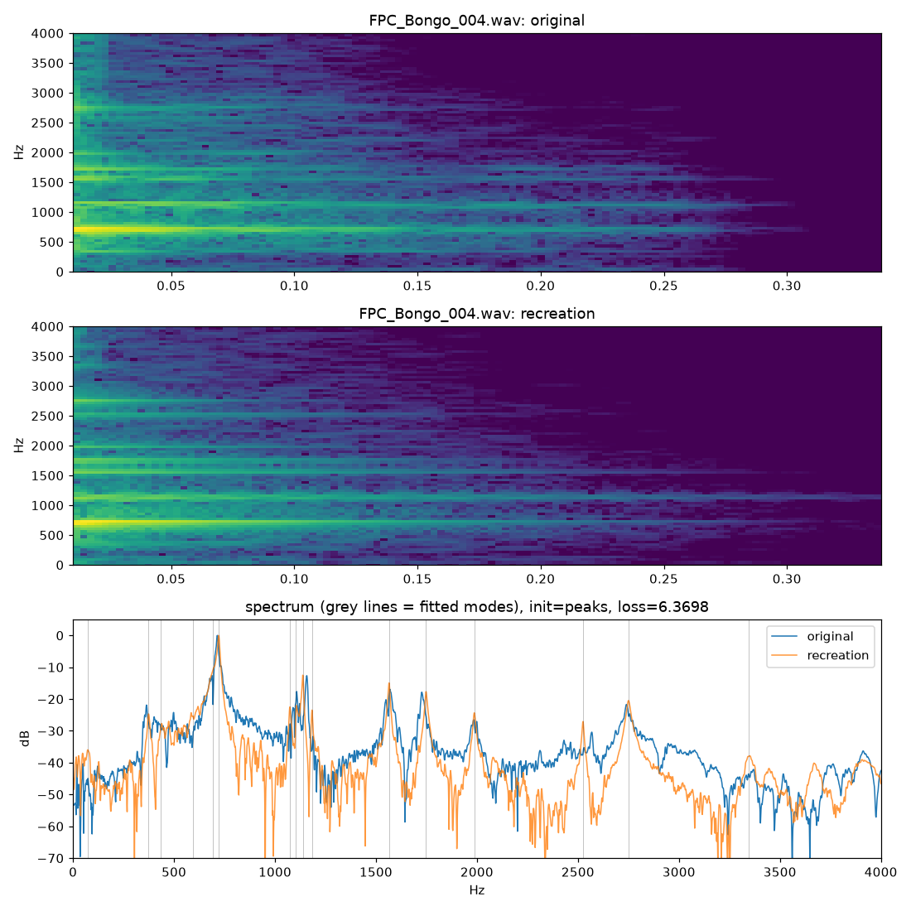

# tone-chase-mue

Recreating hand drum samples with a fitted modal synth.

This was made for a Music Engineering class assignment: pick a tone from a recording and recreate it
using AI. Claude wrote the code. We chose the target, judged the results by ear, and steered.

## How it works

The drum head is modeled as an ideal circular membrane with a fixed edge. Each mode of vibration is a
ZDF state-variable bandpass filter with its own frequency, decay time and level. A short burst of
filtered noise stands in for the hand hitting the head. The filter settings are fitted to a sample by
gradient descent in PyTorch. The fit starts either from the strongest peaks in the sample's spectrum or
from the ideal membrane's Bessel-function mode ratios.

Once a drum is fitted, it can be played in ways the sample can't: struck at a different spot, hit
softer or harder, retuned, or damped.

## Results

We fitted bongo and conga hits from FL Studio's FPC kit. The bongo turned out to be close to an ideal
membrane: its (1,1) and (2,1) modes are within 0.5% of the theoretical ratios. The fitted resonances
sound very close to the originals, but the attack is softer than the real hit.



Audio:
- Bongo recreation: [full](out_fit/FPC_Bongo_004_peaks/recreation.wav), [modes only](out_fit/FPC_Bongo_004_peaks/modes_only.wav)
- Conga recreation: [full](out_fit/FPC_Conga_001a_peaks/recreation.wav)
- The fitted bongo played different ways: [variations](out_play/FPC_Bongo_004_peaks/variations.wav), [groove](out_play/FPC_Bongo_004_peaks/groove.wav)
- The ideal membrane with no fitting: [out_ideal/](out_ideal/)

## Usage

```bash
pip install -r requirements.txt

python ideal_drum.py                                  # ideal membrane examples -> out_ideal/
python fit_drum.py path/to/hit.wav                    # fit a sample -> out_fit/<name>_peaks/
python fit_drum.py path/to/hit.wav --init bessel      # start from ideal mode ratios instead
python play_drum.py out_fit/<name>_peaks/params.json  # play the fitted drum -> out_play/<name>/
```

Fitting takes a minute or two per sample on a CPU. It uses a GPU if one is available.

The FL Studio samples aren't included, because their license doesn't allow redistribution. Any short
drum hit in a WAV file will work. Single-headed drums with an open tone (congas, bongos, toms) fit best.
